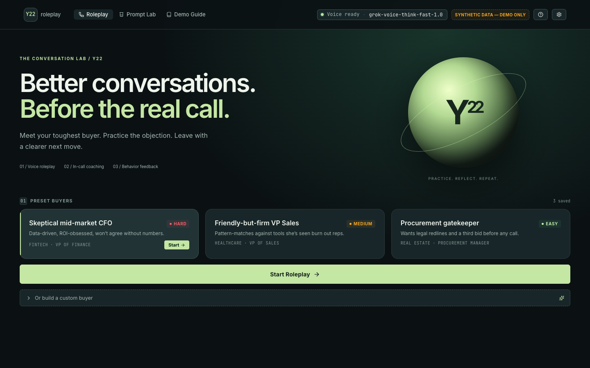
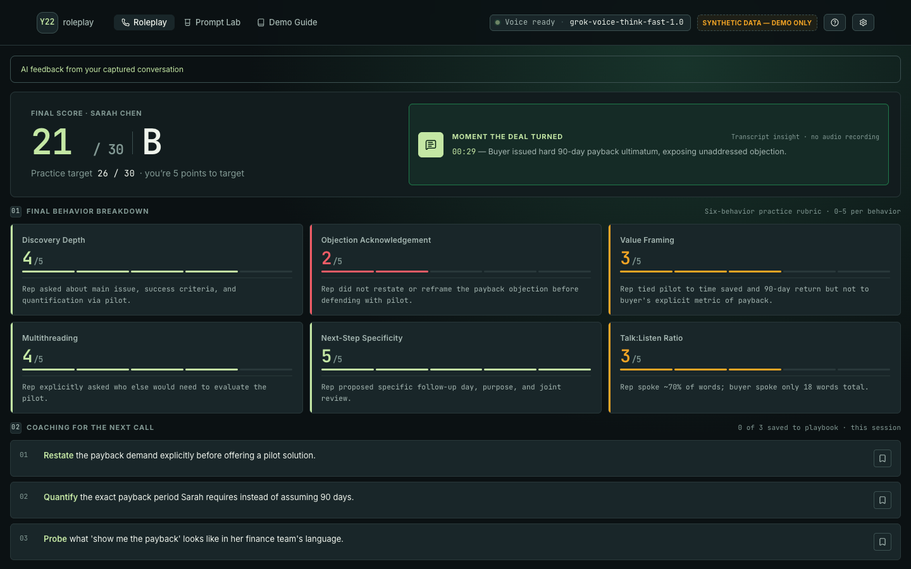
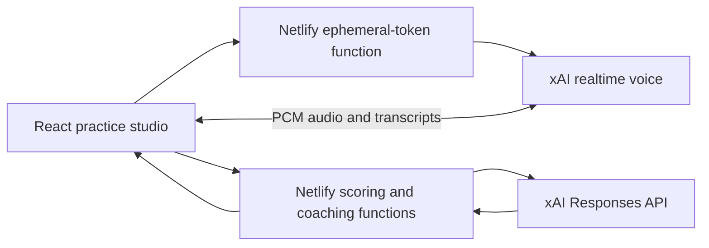

# Y22 Conversation Lab

**Practice a difficult sales conversation with an AI buyer, then review the captured transcript and six-behavior coaching scorecard.** Built by [Shanto Mathew](https://github.com/shanto12) as a personal voice AI project.

[Open live application](https://y22-ai-sales-roleplay.netlify.app) · [Explore the voice transport](src/lib) · [Review scoring safeguards](tests/scoring.test.mjs)



## Review it in three minutes

1. Choose a fictional buyer preset or configure industry, title, difficulty and objection style.
2. Start a roleplay and allow microphone access. Ask discovery questions and respond to the buyer's objections.
3. End the call to inspect six behavior scores, their rationales, a transcript insight and coaching suggestions.
4. Review the transcript, bookmark coaching points for the current session, or practice the same persona at a harder setting.

Voice and scoring use real xAI model requests. If voice initialization fails, the interface explicitly labels its scripted sample and illustrative scores.



This screenshot shows one actual production voice test scored **21/30**, using synthetic microphone audio and a fictional buyer. It is an example output, not a sales-performance benchmark.

## Engineering worth inspecting

- **Realtime voice:** browser AudioWorklet capture sends microphone PCM audio over a WebSocket, using a server-issued ephemeral token.
- **Conversation evidence:** provider transcript revisions are coalesced by item ID; captured text drives scoring and optional in-call coaching.
- **Fail-closed scoring:** missing configuration, empty conversations, provider errors and incomplete model results display unavailable feedback rather than fabricated grades.
- **Persona consistency:** preset and custom buyer configuration reaches the actual live conversation.
- **Practical feedback UI:** six behaviors, rationales, transcript review and session-local coaching bookmarks, with responsive desktop/mobile layouts.

## Architecture and state



| Layer | Implementation |
|---|---|
| Interface | React, TypeScript and Vite |
| Voice | AudioWorklet capture, WebSocket transport and browser audio playback |
| Hosted backend | Netlify Functions for ephemeral tokens, persona generation, scoring and coaching |
| Models | `grok-voice-think-fast-1.0` for voice; `grok-4.20-0309-non-reasoning` is the current default text model |
| State | In-memory call state, transcript and coaching bookmarks |
| Persistence | No database, account system or persistent customer-call store |

Provider keys stay server-side. The [score function](netlify/functions/score.mjs) bounds provider time and output; [call state](src/hooks/useCallMachine.ts) keeps live results separate from the scripted sample. [Transcript tests](src/lib/transcript.test.ts) cover repeated provider revisions.

## Run locally

Use a current Node.js LTS release and npm.

```sh
git clone https://github.com/shanto12/y22-ai-sales-roleplay.git
cd y22-ai-sales-roleplay
npm ci
npm run dev
```

Vite serves the interface; unavailable local functions result in the clearly labeled sample experience. For live voice and server functions, supply `XAI_API_KEY` securely to the local server environment and run:

```sh
npx netlify-cli dev
```

Optional server overrides are `GROK_VOICE_MODEL`, `SCORING_MODEL` and `XAI_API_BASE_URL`. Omit `SCORING_MODEL` to use the current code default above; the older `.env.example` lists a legacy override. Never put provider credentials in browser-exposed `VITE_` variables.

## Verify the code

```sh
npm run lint
npm run typecheck
npm test -- --maxWorkers=1
node --test tests/scoring.test.mjs
npm run build
npm audit --omit=dev
```

These commands match the current package scripts. The standalone scoring regression suite verifies that provider failure, malformed output, incomplete grades, empty transcript and missing keys do not emit canned live results. No paid provider call is required for these unit/regression checks.

September 2026 production review covered real two-way provider voice with synthetic microphone input, relevant buyer responses, final scoring, controls and responsive layouts. A separate real Chrome pass covered the interface. Physical microphone/speaker quality was not evaluated; these checks do not establish a subjective voice-quality rating.

## Scope

Prompt Lab compares illustrative prompts and sample metrics; it does not run a live evaluation service or change the active voice prompt. Transcript review does not replay an audio recording. Bookmarks last for the current session. The short live test did not retain the exact in-call coaching response body, so its screenshot tip attribution is not independently evidenced. No CRM connection, telephone call, customer message or peer-performance benchmark is claimed.

This independent demonstration is not affiliated with or endorsed by Y22 or xAI. Personas and test conversations are fictional; no customer data is included.
